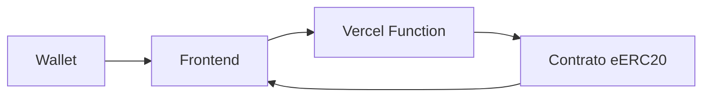

# SecretPoints - eERC20 na Avalanche Fuji

Este projeto implementa um MVP de pontos secretos usando o padrão eERC20 na rede Avalanche Fuji.

## Tecnologias

- Vite + React + TypeScript
- Tailwind CSS
- Zustand (State Management)
- React Query (Data Fetching)
- Ethers.js (Web3)
- React Router DOM
- ESLint + Prettier

## Estrutura

```
src/
├─ components/     # Componentes reutilizáveis
├─ hooks/         # Hooks customizados (useSecretPoints, useMintPoints)
├─ pages/         # Páginas (Dashboard, Admin)
├─ routes/        # Configuração de rotas
├─ services/      # Serviços (Web3, criptografia)
├─ store/         # Estado global (Zustand)
├─ styles/        # Estilos globais
├─ types/         # Tipos TypeScript
└─ utils/         # Funções utilitárias
```

## Fluxo de Dados



## Setup

1. Instale as dependências:
```bash
npm install
```

2. Configure as variáveis de ambiente:
```bash
cp .env.example .env
```

3. Inicie o servidor de desenvolvimento:
```bash
npm run dev
```

## Scripts

- `npm run dev` - Inicia o servidor de desenvolvimento
- `npm run build` - Build de produção
- `npm run preview` - Preview do build
- `npm run lint` - Checa problemas de lint
- `npm run format` - Formata o código
- `npm test` - Roda os testes
- `npm run test:e2e` - Roda os testes E2E

## Testes

- Unitários/Integração: Vitest + React Testing Library
- E2E: Playwright

## CI/CD

- GitHub Actions: lint, testes e build em cada PR
- Deploy automático no Vercel (frontend + functions)

## Licença

MIT
